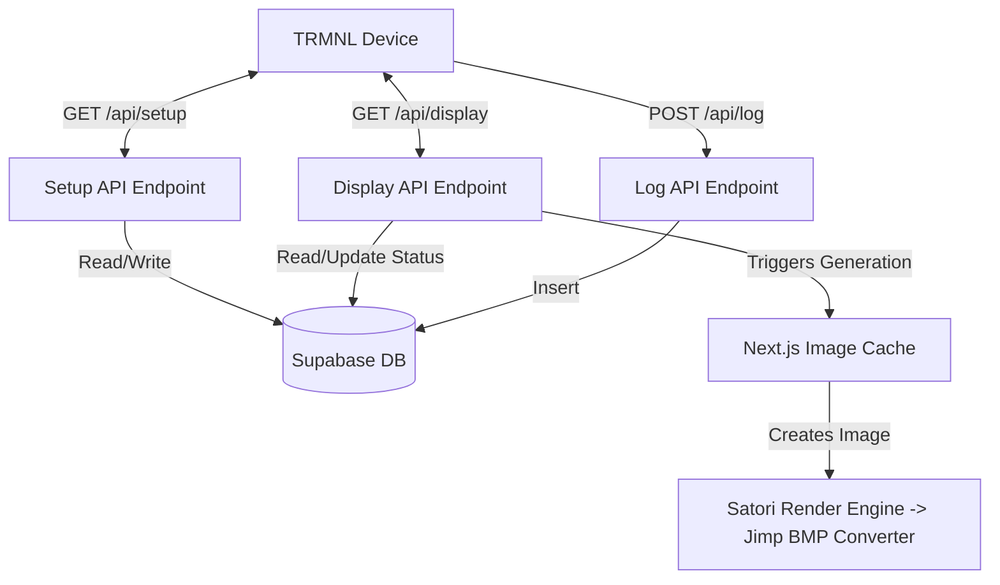

# byos-nextjs Context

## SECTION 1: HIGH-LEVEL ARCHITECTURE

### 1. Project Purpose
BYOS Next.js is a Bring-Your-Own-Server implementation for the TRMNL device. Built with Next.js 15, React 19, and Tailwind CSS, it robustly handles device management, dynamic screen generation using Satori for 1-bit BMP output, and system logging using a Supabase database backend.

### 2. Entry Points

* `[CMD] GET /api/setup`: Device registration and API key generation. Automatically assigns a friendly ID and tracks MAC addresses.
  * *Location:* `app/api/setup/route.ts` (Lines 7-258)
* `[CMD] GET /api/display`: Primary endpoint for screen content delivery. Provides the refresh rate and image to render.
  * *Location:* `app/api/display/route.ts` (Lines 188-820)
* `[CMD] POST /api/log`: Error and issue reporting endpoint for TRMNL devices.
  * *Location:* `app/api/log/route.ts` (Lines 67-872)

### 3. Architecture Diagram

### 4. Config & Env
Critical ecosystem keys loaded via `process.env`:
* `NEXT_PUBLIC_SUPABASE_URL`: Supabase project database connection URI.
* `NEXT_PUBLIC_SUPABASE_ANON_KEY`: Supabase anon key for client/server querying.
* `POSTGRES_URL` (optional): Fallback connection string for local initialization.

## SECTION 2: LOW-LEVEL DICTIONARY

> `[STRUCT] Device`
> * **Signature:** `type Device = { id: number; name: string; mac_address: string; api_key: string; friendly_id: string; screen: string | null; refresh_schedule: RefreshSchedule | null; ... }`
> * **Purpose:** Represents a registered TRMNL device state and configurations.
> * **Source:** `lib/supabase/types.ts` : `L11-L28`
> * **URL:** `{{Base_URL}}/lib/supabase/types.ts#L11-L28`

> `[STRUCT] TimeRange`
> * **Signature:** `type TimeRange = { start_time: string; end_time: string; refresh_rate: number; }`
> * **Purpose:** Individual block of time with specific refresh interval definitions.
> * **Source:** `lib/supabase/types.ts` : `L30-L34`
> * **URL:** `{{Base_URL}}/lib/supabase/types.ts#L30-L34`

> `[STRUCT] RefreshSchedule`
> * **Signature:** `type RefreshSchedule = { default_refresh_rate: number; time_ranges: TimeRange[]; }`
> * **Purpose:** Object governing when the device refreshes and goes to sleep.
> * **Source:** `lib/supabase/types.ts` : `L36-L39`
> * **URL:** `{{Base_URL}}/lib/supabase/types.ts#L36-L39`

> `[STRUCT] Log`
> * **Signature:** `type Log = { id: number; device_id: number; friendly_id?: string | null; log_data: string; created_at: string | null; }`
> * **Purpose:** Hardware execution logs reported directly from TRMNL devices.
> * **Source:** `lib/supabase/types.ts` : `L41-L47`
> * **URL:** `{{Base_URL}}/lib/supabase/types.ts#L41-L47`

> `[STRUCT] SystemLog`
> * **Signature:** `type SystemLog = { id: string; created_at: string | null; level: string; message: string; source: string | null; metadata: string | null; trace: string | null; }`
> * **Purpose:** Internal server metrics and error records generated by the BYOS backend APIs.
> * **Source:** `lib/supabase/types.ts` : `L49-L57`
> * **URL:** `{{Base_URL}}/lib/supabase/types.ts#L49-L57`

> `[FUNC] logInfo`
> * **Signature:** `export const logInfo = (message: string, options?: LogOptions) => void`
> * **Purpose:** Convenience helper for logging INFO level messages to Supabase and stdout.
> * **Source:** `lib/logger.ts` : `L75-L77`
> * **URL:** `{{Base_URL}}/lib/logger.ts#L75-L77`

> `[FUNC] logError`
> * **Signature:** `export const logError = (error: Error | string, options?: LogOptions) => void`
> * **Purpose:** Convenience helper for logging ERROR level messages to Supabase with trace details.
> * **Source:** `lib/logger.ts` : `L80-L81`
> * **URL:** `{{Base_URL}}/lib/logger.ts#L80-L81`

> `[FUNC] readLogs`
> * **Signature:** `export const readLogs = async (options: { limit?: number; page?: number; levels?: LogLevel[]; sources?: string[]; search?: string; groupSimilar?: boolean; } = {}): Promise<{ logs: Log[]; total: number }>`
> * **Purpose:** Filters and retrieves server-side system logs for debugging UI.
> * **Source:** `lib/logger.ts` : `L146-L212`
> * **URL:** `{{Base_URL}}/lib/logger.ts#L146-L212`

> `[FUNC] calculateRefreshRate`
> * **Signature:** `function calculateRefreshRate(refreshSchedule: RefreshSchedule | null, defaultRefreshRate: number, timezone: string = timezones[0].value): number`
> * **Purpose:** Analyzes current time against TRMNL device settings to determine device sleep seconds.
> * **Source:** `app/api/display/route.ts` : `L38-L75`
> * **URL:** `{{Base_URL}}/app/api/display/route.ts#L38-L75`

> `[FUNC] updateDeviceStatus`
> * **Signature:** `async function updateDeviceStatus({ friendlyId, refreshDurationSeconds, batteryVoltage, fwVersion, rssi, timezone }: { friendlyId: string; refreshDurationSeconds: number; batteryVoltage: number; fwVersion: string; rssi: number; timezone?: string; }): Promise<void>`
> * **Purpose:** Updates persistent physical attributes and status details into device records implicitly during screen pull requests.
> * **Source:** `app/api/display/route.ts` : `L92-L172`
> * **URL:** `{{Base_URL}}/app/api/display/route.ts#L92-L172`

> `[FUNC] getInitData`
> * **Signature:** `export const getInitData = cache(async (): Promise<InitialData> => { ... })`
> * **Purpose:** Preloads database statuses, device states, and global backend metadata into React Cache contexts.
> * **Source:** `lib/getInitData.ts` : `L35-L92`
> * **URL:** `{{Base_URL}}/lib/getInitData.ts#L35-L92`
